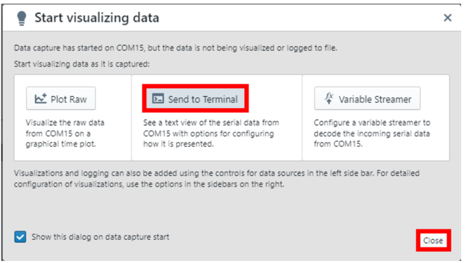

<!-- Please do not change this logo with link -->

<a target="_blank" href="https://www.microchip.com/" id="top-of-page">
   <picture>
      <source media="(prefers-color-scheme: light)" srcset="images/mchp_logo_light.png" width="350">
      <source media="(prefers-color-scheme: dark)" srcset="images/mchp_logo_dark.png" width="350">
      
   </picture>
</a>

# Signal Acquisition at Higher Sampling Frequency using ADCC of PIC18-Q24 Microcontroller Family

## Introduction

The PIC18-Q24 family of microcontrollers are equipped with a rich set of Core Independent Peripherals (CIP), such as Analog-to-Digital Converter with Computation (ADCC), Direct Memory Access (DMA), Serial Peripheral Interface (SPI) and Universal Asynchronous Receiver-Transmitter (UART), etc. The integrated ADCC peripheral, offering a 10-bit resolution that can handle conversion processes at speeds reaching up to 300 kilo samples per second.

The main objective of this code example is to demonstrate the higher data sampling capability of the 10-bit ADCC peripheral within the PIC18-Q24 device family thereby effectively reproducing the sampled input signal. Additionally, it highlights the CIP capabilities of 8-bit PIC microcontrollers by effectively utilizing the ADCC, DMA, SPI and UART peripherals within the code example. Specifically, the DMA peripheral is used to transfer the ADCC conversion results to the SPI peripheral data transmit buffer register without CPU intervention, and the SPI interface is used to output the received ADCC conversion results to the Data Visualizer tool in real-time and at a faster rate.

This code example is developed using PIC18F56Q24 microcontroller. However, it is relevant to all the 8-bit PIC Microcontroller families that are supported with 10-bit ADCC module that is capable of sampling input signals up to 300 ksps.

## Related Documentation

* [PIC18F56Q24 Product Page](https://www.microchip.com/en-us/product/pic18f56q24)
* [PIC18-Q24 Product Family of Microcontrollers](https://www.microchip.com/en-us/products/microcontrollers-and-microprocessors/8-bit-mcus/pic-mcus/pic18-q24)
* [PIC18F56Q24 Code Examples on MPLAB Discover](https://mplab-discover.microchip.com/v2?dsl=PIC18F56Q24)
* [PIC18-Q24 Family Code Examples on GitHub](https://github.com/orgs/microchip-pic-avr-examples/repositories?q=Q24&type=all&language=&sort=)

## Description

  
   Figure 1. Block Diagram 

This section covers the implementation details of the code example. The PIC18F56Q24 Curiosity Nano and Power Debugger boards are used as a development platform. 

Input Signal Generation: A pulse signal is generated by using 8-bit buffered DAC, DMA, Timer 2 and FVR peripherals of PIC18F56Q24 microcontroller. The signal is generated by continuously adjusting the output of a DAC to create a pulse signal made of a series of discrete steps. The DMA module has been used for seamless and direct data transfers between different memory regions without intervention from the CPU. The values of DAC input data register are loaded from look-up table stored in RAM memory using DMA. The frequency of pulse signal is decided by the frequency of updating DAC DATA register and total number of points/samples in one cycle of the signal. In this example, the number of data samples per cycle of the pulse signal is set as 100 and is stored in a Look Up Table (LUT) in RAM memory. This data is transferred to DAC data register using DMA which is hardware triggered by Timer 2 overflow interrupt occurring every 10 µs.

Therefore, frequency of signal, f = 1 / (Total no of samples per cycle * Timer 2 period) = 1/ (100 * 10µS) = ~1000 Hz.

**Note:** If the number of DAC samples in the pulse signal is kept constant, then frequency of the signal can be changed by changing the Timer 2 period. 

The generated signal is fed as input to the ADCC peripheral by interconnecting the DAC and ADCC peripherals without the need of external connection.

In this code example, the firmware is developed to sample the input signal at two different sampling frequencies: 50 ksps and 300 ksps. By default, the ADCC module samples the input signal at 300 ksps sampling frequency, and the user needs to press the on-board mechanical switch (SW0) to change the ADCC sampling frequency to 50 ksps and vice versa. The sampled ADCC conversion data are transmitted to the data visualizer in real time through the Data Gateway Interface (DGI) of the power debugger board and reproduce the input signal in the Time Plot window. Additionally, the on-board user LED (LED0) blinks at a specific rate depending on the sampling frequency selection. The instructions for the user to change the sampling frequency, via a switch press event, along with the selected sampling frequency value, are transmitted to the data visualizer tool using the on-board debugger module and displayed on the terminal window.

## Software Used

This application uses MPLAB® X IDE compiler and graphical code generator to provide an easy and hassle-free user experience.

The following tools are used for this demo application:

* [MPLAB® X IDE](https://www.microchip.com/mplab/mplab-x-ide) v6.20 or newer
* [XC8 compiler](https://www.microchip.com/mplab/compilers) v2.46 or newer
* [MPLAB® Code Configurator(MCC)](https://www.microchip.com/mplab/mplab-code-configurator) v5.7.1 or newer
* [Standalone MPLAB® Data Visualizer 1.3.1665](https://www.microchip.com/en-us/tools-resources/debug/mplab-data-visualizer) or newer
* [Microchip PIC18F-Q Series Device Support](https://packs.download.microchip.com) 1.25.433 or newer
* [Data Visualizer](https://www.microchip.com/en-us/tools-resources/debug/mplab-data-visualizer) v1.3.1665 or newer
* ADCC MCC Melody Driver 1.0.6
* SPI MCC Melody Driver 1.2.0
* DMA Driver 1.1.2
* UART Driver 1.10.0
* DAC Driver 4.0.9
* TMR0 Driver 4.0.13
* TMR2 Driver 4.0.18

## Hardware Used

* [PIC18F56Q24 Curiosity Nano board](https://www.microchip.com/en-us/development-tool/EV01E86A")
* [Curiosity Nano base for Click boards](https://www.microchip.com/developmenttools/ProductDetails/AC164162)
* [Power Debugger board](https://www.microchip.com/en-us/development-tool/atpowerdebugger)

## Hardware Setup

  
   Figure 2. Hardware Setup 

The DGI SPI mode of the power debugger board is used for transmitting data from the PIC18F56Q24 microcontroller to the data visualizer tool. The table below provides the required connections between PIC18F56Q24 Curiosity Nano and Power Debugger boards.  Also, both the boards are powered up by 5V supply.

| DGI header of Power Debugger  | PIC18F56Q24 Curiosity Nano board  | 
|-------------------------------|-----------------------------------|                                                                                        
| CLK                           | RC3 (SCK1)                        | 
| MISO(<--)                     | RB3 (MOSI)                        |   
| CS                            | RA5 (Slave Pin)                   |   
| REF                           | VTG                               |  
| GND                           | GND                               |

## Firmware Implementation

* The application firmware is developed on PIC18F56Q24 microcontroller, generated using MPLAB X IDE and MCC. The implemented firmware is performed on PIC18F56Q24 Curiosity Nano development board. 

* The microcontroller peripherals, TIMERS, ADCC, DAC, FVR, DMA, UART and SPI are used to implement the functionalities of the ADCC sampling speed demonstration. 

* The TMR0 peripheral is used to blink the LED at a specific rate, depending on the sampling frequency selection. At 300 ksps sampling frequency, the LED blinks with a 50 ms delay and, at 50 ksps sampling frequency, the LED blinks with a 200 ms delay.

* The TMR2 peripheral is configured to generate an overflow interrupt for every 10 µs, used to trigger the DMA1 module. 

* The TMR2 overflow interrupt acts as trigger source to the DMA1 peripheral instance. The DMA1 module is configured to transmit one byte of data from the LUT, stored in the RAM, to the DAC data register for each TMR2 overflow interrupt. 

* The DAC1 peripheral is configured with FVR as its positive reference and ground as its negative reference and is used to generate an output pulse signal. The output from the DAC1 peripheral is fed as an input to the ADCC module.

* The ADCC module is configured in Basic mode with Fosc as the peripheral clock and FVR as the voltage reference, to acquire the input signal. The ADCC result register (ADRES) is left justified, so the conversion data stored in ADRESH is used for the computation and the data in ADRESL register is ignored.

* The ADCC conversion completion interrupt is configured as a trigger source to the DMA2 peripheral instance. The DMA2 module is configured to transmit the ADCC conversion result to SPI Transmit buffer register. 

* The SPI1 peripheral is configured as a Host with an 8MHz peripheral clock, used to transmit the ADCC conversion data to the data visualizer tool through Data Gateway Interface (DGI) of power debugger board. 

* The UART2 peripheral instance is used to display user instructions and the selected sampling rate for ADCC peripheral in the terminal window of the data visualizer tool. 

* In the project settings, XC8 compiler optimization is set to optimization 2, which performs optimizations of all generic code generators and minimal assembly optimizations.

## Application Flow Diagram

The below Figure 3 shows the application firmware flow diagram of this code example.

  
   Figure 3. Application Flow Diagram 

**Note:** The pulse signal generation and signal reproduction for the Data Visualizer are facilitated by the use of CIPs, allowing the process to run independently of the CPU. Consequently, the application firmware does not require any additional coding to achieve these functions.

## MPLAB Data Visualizer Configuration

* Connect the hardware as explained in the hardware setup section.
* To open the Time Plot and Terminal window on standalone MPLAB Data Visualizer tool, follow the steps mentioned below.
	1.	Steps to open Time Plot window on Data Visualizer
	2.	Steps to open Terminal window on Data Visualizer

**Steps to open Time Plot window on MPLAB Data Visualizer**

The ADCC conversion data is being transmitted to the data visualizer in real time through the power debugger and the sampled input signal has been reproduced on the time plot window. Follow the steps below to open and configure the time plot window on data visualizer.
1. Enable the DGI interface of the power debugger, to display the supported DGI interface. 
2. Select the SPI interface and click on the  (right aligned triangle) symbol.

  

3. Then a pop-up window appears, select the “Plot Raw” option, and close the pop-up window.

  

4. To start displaying the ADC conversion result, click the  (double triangle) symbol with the text named as “Show live data”, which appears at the center of the time plot window.

**Steps to open Terminal window on MPLAB Data Visualizer**

The user is provided with an option to choose a sampling frequency setting to be used for the ADCC peripheral from the supported frequencies by pressing the on-board switch SW0. These instructions are displayed on the terminal window of Data Visualizer. Additionally, the selected frequency is displayed on the terminal window after the user selects the sampling frequency option. Follow the steps listed below to open and configure the terminal window.
1. Open the standalone MPLAB Data Visualizer tool.
2. Click the Connections tab, which is available on the top left of the data visualizer.
3. Open the COM 15 settings window. By default, the Baud Rate is set to 9600. 

**Note:** The COM port number can vary depending on the availability of the port.

  

4. Click the  symbol on COM 15 tab. Then a pop-up window appears, select the “Send to Terminal” option and close the pop-up window.

  

5. Text messages start printing on the terminal window as soon as firmware is loaded to the microcontroller.

## Demo Operation

* Ensure the hardware is connected as explained in the hardware Setup section and Data Visualizer tool is setup as explained in Data Visualizer Configuration section. 
* Download firmware from [Microchip-Github](https://github.com/orgs/microchip-pic-avr-examples/repositories?q=Q24&type=all&language=&sort=) and open the project in MPLAB X IDE. Build the project to make sure there are no build errors. Refer to the [MPLAB User’s Guide](https://ww1.microchip.com/downloads/en/devicedoc/50002027d.pdf) for more details on how to build the project.
* Program the microcontroller by clicking the  (Make and program device) icon on MPLAB X IDE 
* The waveform below represents the pulse signal of 1 kHz frequency, generated using the DAC module

  
   Figure 4. Pulse Signal Generation Using DAC 

* Once the programming is completed, observe the user instructions on the terminal window of the data visualizer tool, and the user LED on the board will start blinking. 

  

* By default, the application firmware is configured to sample the input signal at a rate of 300 ksps using the ADCC module. The figure below shows the reproduced signal, when it is sampled at 300ksps using the ADCC module.

  
   Figure 5. Reproduced Signal at 300 ksps Sampling Rate 

**Note:**: In the time-plot window, X-axis represents time and Y-axis represents ADC count value. The ADC conversion result is left justified, and the resultant 8-bit data stored in the ADRESH register is plotted on the time-plot window.

* Now press the switch (SW0) to change the ADCC sampling frequency to 50 ksps. 
* The configured sampling frequency and the instructions for the user to switch the sampling rate are displayed on the terminal window, as shown below. 

  

* Additionally, the user LED on the board will also blink at a slower rate than with the 300 ksps sampling rate setting.
* The figure below shows the reproduced signal, when sampled it at a rate of 50 ksps using the ADCC module. Observe that, in the reproduced signal, some samples are missed at both the positive and negative peaks of the signal

  
   Figure 6. Reproduced Signal at 50 ksps Sampling Rate 

**Note:**: In the time-plot window, X-axis represents time and Y-axis represents ADC count value. The ADC conversion result is left justified, and the resultant 8-bit data stored in the ADRESH register is plotted on the time-plot window.

## Conclusion

This code example showcases the PIC18F-Q24 microcontroller's ADCC module's ability to sample input signals of 300 ksps. This high-speed sampling allows for rapid and precise data acquisition and more accurate and responsive system behavior. The integration of the ADCC and other CIPs within the microcontroller simplifies design, reduces the need for external components, and enhances overall system reliability.

